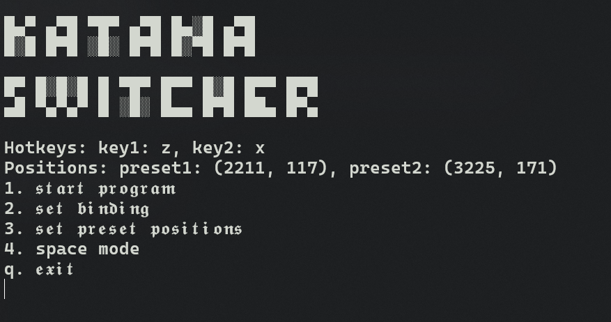

# BOSS Katana 50 Preset Switcher

A simple application for changing presets in TONE STUDIO while playing guitar.

Since the Katana 50 does not support an external footswitch, this application was created to enable quick effect and preset changes during session. 
All you need is a keyboard or any device that emulates keyboard keys.

## 2 Modes:

- **Two separate keybinds** for switching between specific presets.
- **Space mode**: Switch between two presets using a single button.

## How to use:
### 2 binds mode:
- set the binding for 2 keys
- set the position where the mouse should go:
  * put the mouse cursor onto first preset you want to use, then press 1
  * put the mouse cursor onto second preset you want to use, then press 2
  * all positions should be saved
  * **note** remember that you have to use imported presets on your katana (on the left side), for no delay switching.

### Space mode:
- go into space mode
- set the first preset position with pressing 1
- set the second preset position with pressing 2
- you'll be switching between these two only using the spacebar

to stop the switcher use esc.

